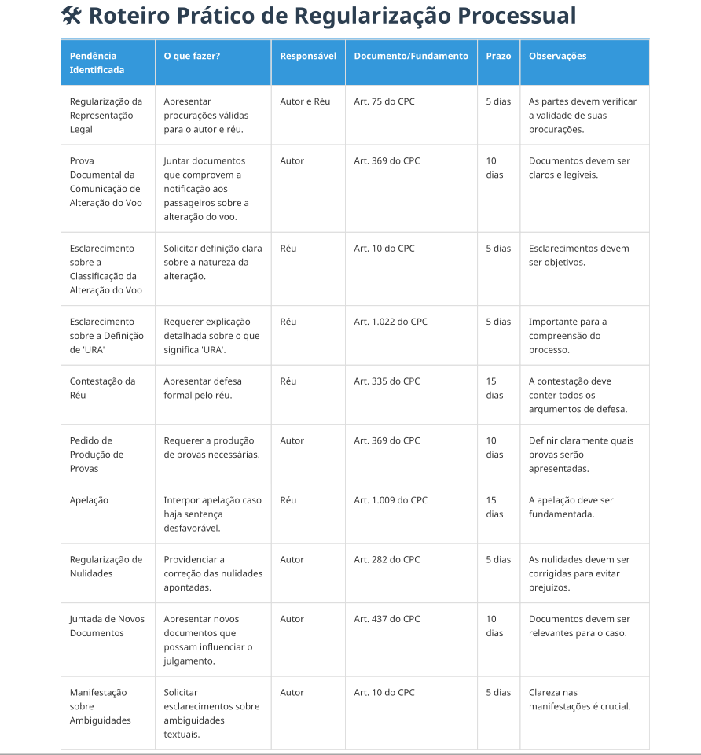
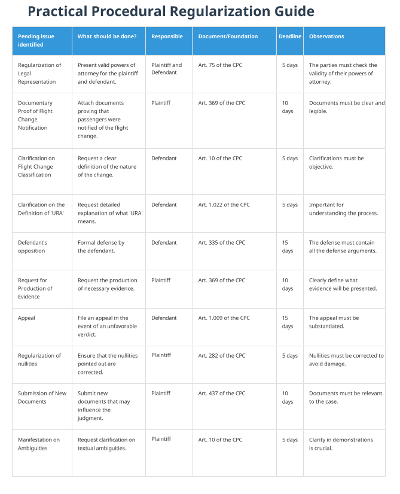

# Legal-Conformity-Guidance-Agent

## 📢 Introduction

In the Brazilian legal context, ensuring the formal regularity of procedural documents is essential for the progress and security of judicial proceedings. Small mistakes, omissions, or inconsistencies can lead to nullities, delays, or harm to the parties involved.

With this in mind, this system was designed to automate document analysis, providing a detailed and reliable evaluation of the formal aspects of legal documents.  
Using a sequence of specialized tasks, the project identifies, classifies, and organizes all relevant information from the document, highlights possible irregularities, and generates a practical roadmap for its regularization, always in accordance with Brazilian legislation.

The goal is to offer legal professionals, law firms, and legal departments an efficient, clear, and accessible tool to ensure compliance and agility in case management.

---

## ⚙️ Workflow

1. Extraction of legal data from the document.
2. Interpretation of context and identification of parties, claims, and legal grounds.
3. Analysis of deadlines, nullities, ambiguities, and procedural irregularities.
4. Consolidation of procedural information and assessment of formal regularity.
5. Generation of a practical roadmap: list of mandatory acts, responsible parties, legal grounds, and deadlines to regularize the document.
6. Creation of the final report in PDF, ready for review or delivery to the client.

---

## 📂 Example of Use

### 1. Input

**Portuguese document example:**  
[inputs/portuguese/portuguese_input.pdf](inputs/portuguese/portuguese_input.pdf)

**English document example:**  
[inputs/english/english_input.pdf](inputs/english/english_input.pdf)

---

### 2. Output
> ⚠️ **Important:**  
> The output in **Portuguese** is the original result of the processing, preserving its complete formatting.  
> The output in **English** is merely a translation of the Portuguese output, intended solely for understanding and not for official use.

### 📝 Portuguese Output Example

---

> 📄 **[Full Portuguese Output – Click here to access the full PDF!](outputs/portuguese/Portuguese_Output.pdf)**

---

### 📝 English output example:

---

> 📄 **[Full English Output – Click here to access the complete PDF!](outputs/english/english_output.pdf)**

---

## ⚠️ Important Note About the English Version

Although this project provides an English output for convenience, it is essential to understand that many legal terms, concepts, and expressions in Brazilian Portuguese **do not have exact equivalents in English**.  
The English output is **only a translation of the Portuguese output** and may omit, adapt, or simplify information due to language and legal context limitations.

**The English version should NOT be considered legally accurate or sufficient for legal decisions related to Brazilian law.**  
For complete precision and reliability, always use the original Portuguese version.

> **Attention:**  
> This system was originally developed to operate under Brazilian legislation.  
> For use in other countries, it is necessary to adapt the recognition of terms, fields, procedural categories, deadline rules, and the search for legal grounds according to local legislation.  
> The English output is intended solely for general understanding and international communication.  
> It is not suitable for legal analysis, official documentation, or any decision-making related to Brazilian law and procedures.
